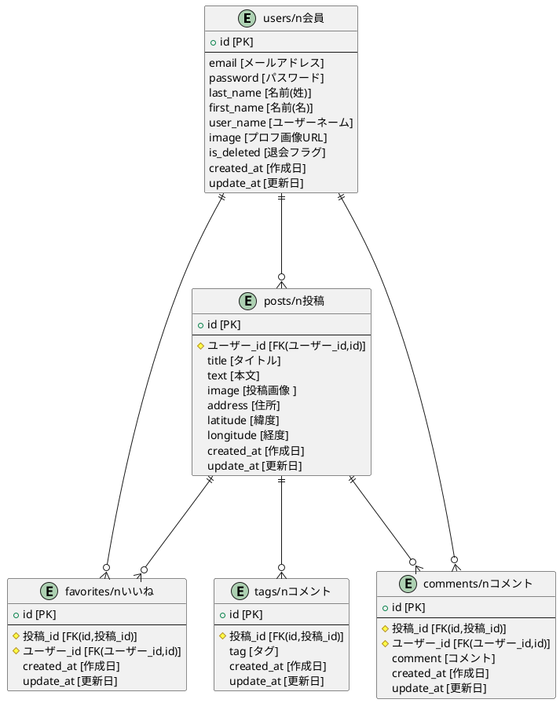

#サイト
Ours

#実装機能URL:
https://docs.google.com/spreadsheets/d/1Dl7L4Hoy5lQdX-j2Uu6Y9HG9oGZhxcCJlUU3o30RDqE/edit?usp=sharing

## サイト概要
### サイトテーマ
<dd>・インテリア等の生活商材を中心としたライフスタイル系のコミュニティサイト</dd>

### テーマを選んだ理由
<dl>
<dd>・一人暮らしを始めるようになってから部屋のレイアウトやインテリア、家電製品などをどうすれば良いか迷っていた。
 SNSなどで情報収集していたものの、総合的なライフスタイル系などの情報サイトはあるが、ユーザー同士で情報交換できるサイトが少ないと感じた。</dd>
<dd>・またこれから一人暮らしを始める人、興味を持ち始めた人が簡単に他ユーザーが投稿しているものを参考にできて、簡単に購入できれば、ストレスなく、時間短縮もできると考えた。
上記のような理由から情報交換できるようなサイトがあれば、どこで買えば安いか、節約術など情報収集がしやすいと考え、今回のテーマに決定した。</dd>
</dl>

### ターゲットユーザ
<dl>
<dd>・ライフスタイル系の商材が好きな方</dd>
<dd>・商材は好きだが、まだノウハウがないユーザー(これから一人暮らしを始める方など)</dd>
</dl>

### 主な利用シーン
<dl>
<dd>・ノウハウの共有や情報収集をしたいとき</dd>
<dd>・インテリアなどが好きなユーザーとの交流の場が欲しいとき</dd>
</dl>

## 設計書
<...>

## 開発環境
- OS：Linux(CentOS)
- 言語：HTML,CSS,JavaScript,Ruby,SQL
- フレームワーク：Ruby on Rails
- JSライブラリ：jQuery
- IDE：Cloud9

## 使用素材
- 外部サービスの画像素材・音声素材を使用した場合は、必ずサービス名とURLを明記してください。
- 使用しない場合は、使用素材の項目をREADMEから削除してください。

## ER図
